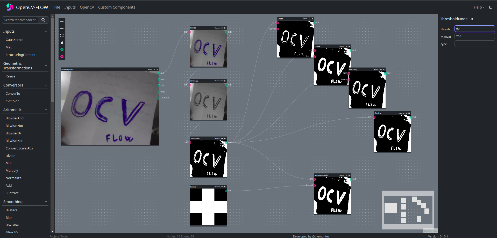

# [OpenCV-Flow](http://opencvflow.org/)

Open Computer Vision - Flow is an IDE for computer vision studies and testing.



## Compatibility

Compatible with OpenCV 4.5 version

## Install
```
git clone https://github.com/Piemontez/opencvflow.git
cd opencvflow
yarn
```

## Start
```
npm dev
```

## Folder Struct

* **core** \ Has node runner
* **ide** \ Has components
* **plugins** \ Has plugin and nodes definitions
* **plugins** \ **opencv** \ All opencv nodes and components
* **plugins** \ **samples** \ Actions with example definitions